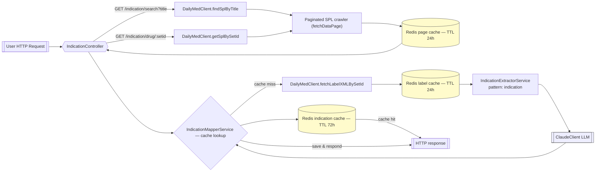

# DailyMed ICD-10 Mapping API

NestJS service that scrapes DailyMed Structured Product Label (SPL) listings, retrieves corresponding med label XML, extracts *possible* indication snippets, and asks an LLM to map them to ICD-10-CM codes. Mappings are cached to save tokens and to prevent "over-scraping". :)


> **Note:** <br>
> Parts of this README, as well as some code commentaries were generated by an AI assistant and have been manually reviewed.

---



---


---

## How requests are processed

1. **Discover an SPL entry**
   * `DailyMedClient.findSplByTitle` scans `/services/v2/spls?page=N` until the first entry whose title contains the search term (case-insensitive).  
   * `DailyMedClient.getSplBySetId` performs the same crawl but looks for an exact `setid` match.  
   * Each page fetched through `fetchDataPage` is cached in Redis for 24h (`dailymed_spl_page_${page}`) so subsequent crawls reuse metadata.

2. **Cache-first indication mapping**
   * Once a matching SPL entry is found, `IndicationController` (`src/infrastructure/controllers/indication.controller.ts`) asks `IndicationMapperService.getIndicationBySetId` for a cached mapping.  
   * Entries are stored under `indication:mapping:{setid}` for 72h (3 days). Cache hits short-circuit the request and immediately return the saved payload plus basic SPL metadata.

3. **Label retrieval & extraction**
   * On a cache miss, the controller fetches the SPL label XML through `DailyMedClient.fetchLabelXMLBySetId`, which proxies `.../fda/fdaDrugXsl.cfm?setid={id}&type=xml` and caches that XML for 24h.  
   * `IndicationExtractorService` (`src/application/services/indication-extractor.service.ts`) lowercases the HTML, finds elements whose text contains the literal word `indication`, and returns the first surrounding context string (up to one hit). The current implementation does **not** inspect “Indications and Usage”/“Contraindications” headers explicitly—only the word `indication`.

4. **LLM mapping & persistence**
   * `ClaudeClient` (`claude-3-5-haiku-20241022`) receives the extracted snippets plus a system prompt that requires JSON output listing ICD-10 mappings and unmappable terms.  
   * `IndicationMapperService.saveIndication` stores `{ setid, title, contexts, llmData, timestamp }` in Redis, indexes the setid, and creates a search alias for the drug title. The saved object (or the raw `ClaudeResponseDto` on the first call) is sent back to the client along with the SPL metadata from DailyMed.

## Key components

| Layer | File | Responsibility |
| --- | --- | --- |
| Application | `src/application/services/indication-extractor.service.ts` | HTML parser that returns up to one context block surrounding the `indication` keyword. |
| Application | `src/application/services/indication-mapper.service.ts` | Redis-backed cache for mappings, including helpers to save, look up, and index entries. |
| Infrastructure | `src/infrastructure/external-services/dailymed/dailymed.client.ts` | Handles SPL pagination, search, XML retrieval, and low-level caching. |
| Infrastructure | `src/infrastructure/external-services/claude/claude.client.ts` | Wraps the Claude Messages API and enforces the mapping prompt. |
| Interface | `src/infrastructure/controllers/indication.controller.ts` | Exposes the `/indication/search` and `/indication/drug/:setid` endpoints, wiring the components above. |

## HTTP endpoints

### `GET /indication/search?title=<text>`
* Title substring search (case-insensitive) against SPL titles. Returns the first match.
* Response shape:

```json
{
  "metadata": {
    "title": "DUPIXENT (dupilumab)",
    "setid": "595f437d-2729-40bb-9c62-c8ece1f82780",
    "published_date": "2024-08-01",
    "spl_version": 12
  },
  "data": {
    "text": "{ ...LLM JSON string... }",
    "promptTokens": 521,
    "completionTokens": 412,
    "totalTokens": 933
  }
}
```

When the mapping already exists in Redis, the `data` payload is the cached object:

```json
{
  "setid": "595f437d-2729-40bb-9c62-c8ece1f82780",
  "title": "dupixent",
  "contexts": [
    "dupixent ... indication text"
  ],
  "llmData": {
    "text": "{ ...same JSON string... }",
    "promptTokens": 521,
    "completionTokens": 412,
    "totalTokens": 933
  },
  "timestamp": 1736728123004
}
```

### `GET /indication/drug/:setid`
* Skips the title search and directly crawls for the specified `setid`.
* Shares the same caching behavior, but on cache miss only the `llmData.text` string is returned as `data`.

Example invocations:

```bash
curl 'http://localhost:3000/indication/search?title=dupixent' | jq
curl 'http://localhost:3000/indication/drug/595f437d-2729-40bb-9c62-c8ece1f82780' | jq
```

## Caching behavior

| Cache | Key pattern | TTL | Source |
| --- | --- | --- | --- |
| SPL pagination | `dailymed_spl_page_${page}` | 24h | `fetchDataPage` |
| Label XML | `${setid}:dailymed_label_xml` | 24h | `fetchLabelXMLBySetId` |
| ICD-10 mapping | `indication:mapping:${setid}` | 72h | `IndicationMapperService` |
| Title alias | `indication:mapping:search:${title}` | 72h | `IndicationMapperService` |

## Running locally

```bash
# Install dependencies
npm install

# Start the NestJS API (requires Redis and a DailyMed proxy target)
npm run start

# Optional dev mode with watch
npm run start:dev
```

Redis connection details are loaded from the usual `ConfigService` keys (`REDIS_HOST`, `REDIS_PORT`), and the DailyMed base URL defaults to `http://localhost:3001/api` unless overridden via `DAILYMED_API_BASE_URL`.

## Known limitations & next steps

1. Only the literal `indication` keyword is inspected; sections such as “Indications and Usage” or “Contraindications” are not parsed yet.
2. The label fetch uses the XML rendition (`type=xml`), not the printer-friendly HTML that often yields cleaner markup.
3. The cached response schema differs between first-call (raw Claude payload) and cache hit (wrapped object). Normalizing the API payload would simplify clients.
4. Claude configuration is fixed to `claude-3-5-haiku-20241022`; adding an abstraction or fallback model would ease experimentation.
